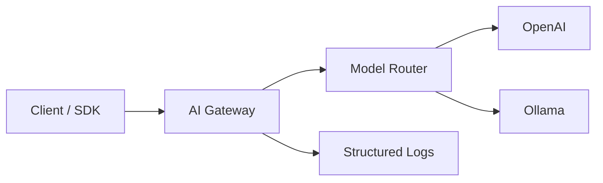

# Architecture

## Overview

AI Gateway sits between clients and upstream LLM providers. Clients use the **OpenAI Chat Completions API**; the gateway resolves the target provider by model name, forwards the request, and returns the response (including SSE streams).

## Request Flow

1. Client sends `POST /v1/chat/completions` with `model` and `messages`.
2. Middleware assigns `X-Request-ID` and logs the request.
3. Router resolves `model` via explicit `routing` table or provider `models` list.
4. Primary provider forwards to upstream `/chat/completions`.
5. On upstream failure, optional **fallback** provider is tried (same request).
6. Response is returned as JSON or proxied SSE stream.

## Components

| Package | Responsibility |
|---------|----------------|
| `internal/config` | Load & validate YAML; env expansion |
| `internal/provider` | OpenAI-compatible HTTP client |
| `internal/router` | Model → provider resolution + fallback |
| `internal/handler` | HTTP API surface |
| `internal/gateway` | Chi router and server lifecycle |

## Routing Rules

Priority:

1. **Explicit route** — `routing[].model` → `provider` (+ optional `fallback`)
2. **Provider models list** — first provider that lists the model wins

## Health Endpoints

| Path | Meaning |
|------|---------|
| `GET /health` | Process is alive (liveness) |
| `GET /ready` | At least one provider configured (readiness) |

## Phase 2+ (planned)

- Redis token-bucket rate limiting per API key
- Circuit breaker per provider
- Prometheus metrics: latency, errors, tokens
- Grafana dashboards and alert rules
