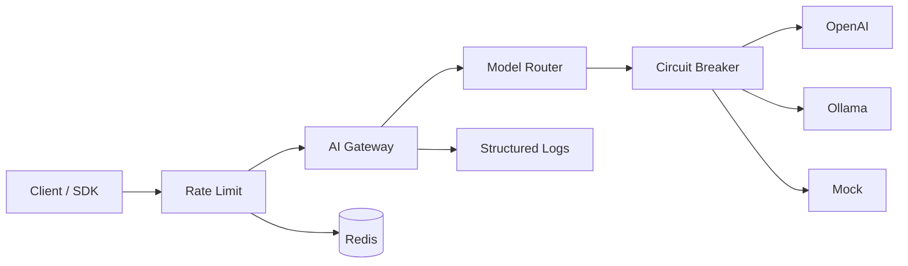

# Architecture

## Overview

AI Gateway sits between clients and upstream LLM providers. Clients use the **OpenAI Chat Completions API**; the gateway resolves the target provider by model name, forwards the request, and returns the response (including SSE streams).

## Request Flow

1. Client sends `POST /v1/chat/completions` with `model` and `messages`.
2. **Rate limit** middleware checks Redis token bucket (key = Bearer token / `X-API-Key` / client IP).
3. Middleware assigns `X-Request-ID` and logs the request.
4. Router resolves `model` via explicit `routing` table or provider `models` list.
5. **Circuit breaker** gates the primary provider (closed → open → half-open).
6. Primary provider forwards to upstream `/chat/completions`.
7. On upstream failure (5xx / network) or open breaker, optional **fallback** provider is tried.
8. Response is returned as JSON or proxied SSE stream.

## Components

| Package | Responsibility |
|---------|----------------|
| `internal/config` | Load & validate YAML; env expansion |
| `internal/provider` | OpenAI-compatible HTTP client + mock |
| `internal/circuitbreaker` | Per-provider failure isolation |
| `internal/ratelimit` | Redis token-bucket limiter |
| `internal/router` | Model → provider resolution + fallback |
| `internal/handler` | HTTP API surface |
| `internal/gateway` | Chi router and server lifecycle |

## Routing Rules

Priority:

1. **Explicit route** — `routing[].model` → `provider` (+ optional `fallback`)
2. **Provider models list** — first provider that lists the model wins

## Circuit Breaker

| State | Behavior |
|-------|----------|
| **Closed** | Normal traffic; consecutive failures counted |
| **Open** | Fast-fail without calling upstream; triggers fallback |
| **Half-open** | Probe requests after `open_timeout`; success closes, failure reopens |

Only **5xx / network** errors count as failures. Upstream **4xx** do not trip the breaker.

## Rate Limiting

Redis **token bucket** per client key:

1. `Authorization: Bearer …`
2. `X-API-Key`
3. Client IP (fallback)

Returns `429 Too Many Requests` with `Retry-After`.

## Health Endpoints

| Path | Meaning |
|------|---------|
| `GET /health` | Process is alive (liveness) |
| `GET /ready` | Providers configured + Redis reachable (if rate limit enabled) |

## Phase 3 (planned)

- Prometheus metrics: latency, errors, tokens
- Grafana dashboards and alert rules
