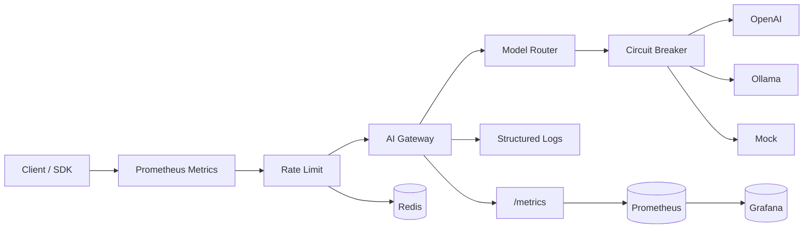

# Architecture

## Overview

AI Gateway sits between clients and upstream LLM providers. Clients use the **OpenAI Chat Completions API**; the gateway resolves the target provider by model name, forwards the request, and returns the response (including SSE streams).

## Request Flow

1. Client sends `POST /v1/chat/completions` with `model` and `messages`.
2. **Metrics** middleware records request count, latency, and in-flight gauge.
3. **Rate limit** middleware checks Redis token bucket (key = Bearer token / `X-API-Key` / client IP).
4. Middleware assigns `X-Request-ID` and logs the request.
5. Router resolves `model` via explicit `routing` table or provider `models` list.
6. **Circuit breaker** gates the primary provider (closed → open → half-open).
7. Primary provider forwards to upstream `/chat/completions`.
8. On upstream failure (5xx / network) or open breaker, optional **fallback** provider is tried.
9. Response is returned as JSON or proxied SSE stream.

## Components

| Package | Responsibility |
|---------|----------------|
| `internal/config` | Load & validate YAML; env expansion |
| `internal/provider` | OpenAI-compatible HTTP client + mock |
| `internal/circuitbreaker` | Per-provider failure isolation |
| `internal/ratelimit` | Redis token-bucket limiter |
| `internal/router` | Model → provider resolution + fallback |
| `internal/handler` | HTTP API surface |
| `internal/gateway` | Chi router and server lifecycle |
| `internal/metrics` | Prometheus metrics definitions and HTTP middleware |

## Routing Rules

Priority:

1. **Explicit route** — `routing[].model` → `provider` (+ optional `fallback`)
2. **Provider models list** — first provider that lists the model wins

## Circuit Breaker

| State | Behavior |
|-------|----------|
| **Closed** | Normal traffic; consecutive failures counted |
| **Open** | Fast-fail without calling upstream; triggers fallback |
| **Half-open** | Probe requests after `open_timeout`; success closes, failure reopens |

Only **5xx / network** errors count as failures. Upstream **4xx** do not trip the breaker.

## Rate Limiting

Redis **token bucket** per client key:

1. `Authorization: Bearer …`
2. `X-API-Key`
3. Client IP (fallback)

Returns `429 Too Many Requests` with `Retry-After`.

## Health Endpoints

| Path | Meaning |
|------|---------|
| `GET /health` | Process is alive (liveness) |
| `GET /ready` | Providers configured + Redis reachable (if rate limit enabled) |
| `GET /metrics` | Prometheus metrics endpoint |

## Prometheus Metrics

| Metric | Type | Labels | Description |
|--------|------|--------|-------------|
| `aigateway_http_requests_total` | Counter | method, path, status | Total HTTP requests |
| `aigateway_http_request_duration_seconds` | Histogram | method, path, status | Request latency |
| `aigateway_http_requests_in_flight` | Gauge | — | Concurrent requests |
| `aigateway_chat_requests_total` | Counter | model, stream | Chat completion requests |
| `aigateway_chat_tokens_total` | Counter | model, type | Token usage (prompt/completion) |
| `aigateway_chat_errors_total` | Counter | model, error_type | Errors by type |
| `aigateway_provider_requests_total` | Counter | provider, model, status | Upstream requests |
| `aigateway_provider_request_duration_seconds` | Histogram | provider, model | Upstream latency |
| `aigateway_router_fallback_total` | Counter | model, primary_provider, fallback_provider | Fallback activations |
| `aigateway_circuit_breaker_state` | Gauge | provider | CB state (0/1/2) |
| `aigateway_circuit_breaker_rejections_total` | Counter | provider | CB rejections |
| `aigateway_ratelimit_allowed_total` | Counter | key_type | Rate limit allowed |
| `aigateway_ratelimit_rejected_total` | Counter | key_type | Rate limit rejected |

## Grafana Dashboard

Provisioned automatically via Docker Compose at `http://localhost:3000` (admin/admin).

Panels: Request Rate, Latency (p50/p95/p99), Token Usage, Error Rate, Provider Latency, Circuit Breaker State, Fallback Activations, Rate Limit stats.
